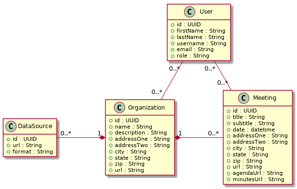

# API v0.1 Specification

## Models

API v0.1 exposes four models: DataSource, Meeting, Organization, and User. The data points for these models and their relations to each other are depicted in the Domain Model below.

### General

Models MUST be passed between the server and the client in the `application/json` MIME format.

The id field for every model is a UUID as defined in [IETF RFC 4122](https://doi.org/10.17487/RFC4122). It MUST be passed between the server and the client as a URN string as outlined in section 3 of the same RFC.

All datetime values MUST be passed between the server and the client as ISO 8601.

All url fields MUST contain a valid absolute URI as defined in [IETF RFC 3986](https://doi.org/10.17487/RFC3986). These should use secure versions of schemas (eg. https, ftps, etc.) when possible, but unsecure schemas are acceptable.

### DataSource

*All DataSources must be linked to exactly one Organization.*

This model includes information necessary for the Data project to process a unique data source. The format field MUST contain a valid MIME Media Type as defined in [IETF RFC 2046](https://doi.org/10.17487/RFC2046).

### Meeting

*All Meetings belong to exactly one Organization.*

This model includes information about one meeting of an Organization. The default values for the address fields (addressOne, addressTwo, city, state, zip) are the values stored for the Organization the Meeting belongs to. When creating or editting the details of a Meeting, each of these fields can be used to define a different address for that Meeting.

### Organization

This model includes information about one Organization in the database.

### User

This model includes information about one User in the database. The email field MUST be a valid email address (addr-spec) as defined in [IETF RFC 5322](https://doi.org/10.17487/RFC5322). The role field MUST be one of the following strings:

* Administrator
* User

A User can 'follow' one or more Organizations. A User may also 'follow' one or more Meetings.

## Endpoints

User/{id}
[Get]
[Post]
[Put]

User/{id}/Meetings
[Get]

User/{id}/Meetings/{id}
[Post]
[Delete]

User/{id}/Organizations
[Get]

User/{id}/Organizations/{id}
[Post]
[Delete]

Meeting/{id}
[Get]

Meeting/{id}/Organization
[Get]

Organization/{id}
[Get]

Organization/{id}/Meetings
[Get]

DataSource/{id}
*Administrators Only*
[Get]
[Post]
[Put]
