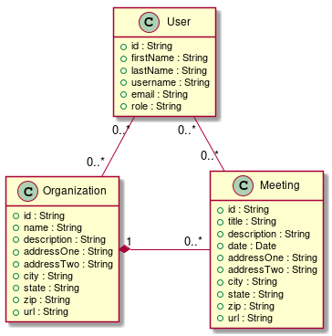

# API v0.1 Specification

## Models

API v0.1 exposes three models: Meeting, Organization, and User. The data points for these models and their relations to each other are depicted in the Domain Model below.

