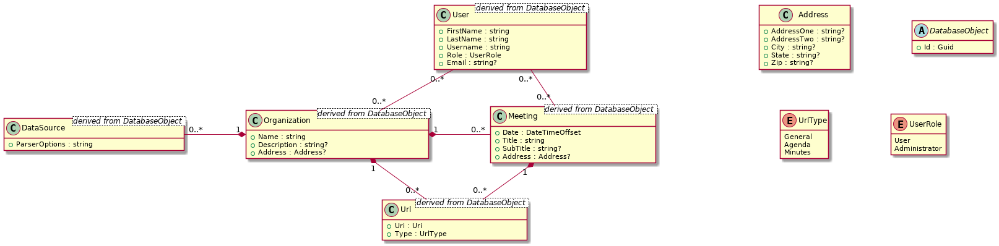

# Architecture Overview

## Primer

The backend is built on .Net Core 3.0 using C# 8. It is split into two projects, the Api project and the Data project.

## Api Project

The Api project uses ASP.Net Core 3.0 and contains the application logic required to create the web server and process requests.

### Controllers

There are four controllers in the Api project:

* DataSourceController
* MeetingController
* OrganizationController
* UserController

These controllers will access the Manager Interfaces via constructor dependency injection.

## Data Project

The Data project uses Entity Framework Core 3.0 and contains the logic required to store and retrieve data from the persistent data source. It exposes Data Managers to the Api project so that the Api can access the data source. The managers operate on base models according to the domain model below.

### Managers

The Manager Interfaces (DevIct.PublicMeetings.Back.Data.Managers) are the interface used to store and retrieve data from the data source. There are four managers:

* IDataSourceManager
* IMeetingManager
* IOrganizationManager
* IUserManager

Each contains a Create, Update, Delete, and FindById method. Refer to [the source code](../../src/data/Managers) for full specification of these methods and any additional methods.

### EFCore

The Entity Framework Core implementation of the Managers is in DevIct.PublicMeetings.Back.Data.EntityFrameworkCore. It uses classes derived from the base models to implement the managers.

The Managers can be added to the dependency injection container via the extension method EntityFrameworkCoreExtensions.AddEntityFrameworkManagers().
